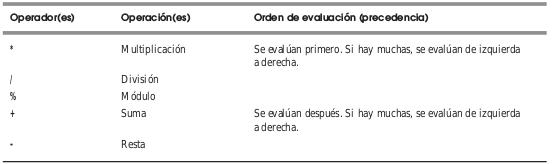
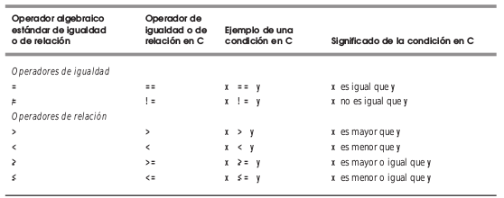
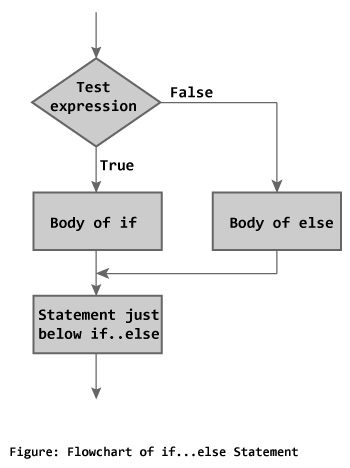
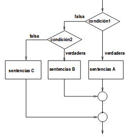
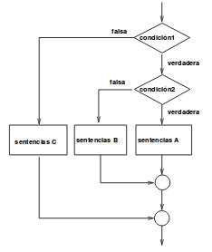

---
title:	
- Programación en C
author:
- Francisco Martínez & César Sánchez
theme:
- metropolis
---

# Aritmética en C

## Operadores Aritméticos


| Operación C | Operador aritméco | Expresiólgebraica | Expresión C |
|:--:	|:--:	|:-:	|:-:	|
|  Suma |  + 	| f + 7	|  f + 7 |
|  Resta | - 	| p - c	| p - c	|
|  Multiplicación |  * 	| bm o `b*m` | `b*m` | 
|  División | / | x/y |  x / y |
|  Módulo |  % 	| r mod s | r % s |

## Operadores Aritéticos


## Precedencia de Operadores



## Operadores de Igualdad y Relación



## Ejercicios.

* Hacer un programa que pida dos números y te diga si son iguales o no.

# Sentencias de Control 

## Sentencia if

Permite ejecutar o no una sentencia o bloque, en función de 
si una expresión es cierta o no.

* Una sentencia: 

```c
if (expresion)
	sentencia;
```

* Un bloque:

```c
if (expresion)
	{
	//bloque
	...
	}
```

"expresion" se construye con operadores lógicos y relacionales.

## Diagrama de Flujo if


## Sentencia if-else

Permite ejecutar una sentencia o bloque u otra sentencia 
o bloque en función de si una expresión es cierta o no.

* 
```c
if (expresion)
	sentencia;
else
	sentencia;
```

*
```c
if (expresion)
	{
	//bloque
	...
	}
else
	sentencia;
```

* Blablabla...

## Diagrama de Flujo if-else	



## Sentencia if e if-else anidados

Entre las sentencias después de `if` o `else`
pueden haber más `if` e `if-else`. Por el lado del `else`:

```c
if (condicion_1)
	{
	...
	}
else
     if (condicion_2)
		{
		...
		}
	else
	     if (condicion_3)
			{....
```

## Sentencia if e if-else anidados

Entre las sentencias después de `if` o `else` pueden haber más `if` e `if-else`. Por el lado del `if`:

```c
if (condicion_1)
	{
	if (condicion_2)
		{
		...
		}
	else
		{
		...
		}
	}
else ...
```

## Diagrama de Flujo if-else-anidados

Pero tambien puede haber más `if` e `if-else` por ambos lados...

```c
if (condicion_1)
	{
	if (condicion_2)
		{
		...
		}
	else
		{
		...
		}
	}
else	
	{...}
```

## Diagrama de Flujo if-else-anidados



## Diagrama de Flujo if-else-anidados




## Ejercicios

- Hacer un programa que diga si un caracter es vocal o consonante.

- Hacer un programa que diga el número más grande entre cuatro números.

## Sentencia Switch

Es como tener varios `if-else` restringiendo la condición
a la comparación de la igualdad entre la expresión y constantes.

* Switch
```c
switch (expresion)
	{
	case cte1: ...
		break;
	case cte2: ...
		break;
	...
	default: ...
	}
```

## Sentencia Switch

* if
```c
if (expresion == cte1)
	{
	...
	}
else
	if (expresion == cte2)
		{
		...
		}
...
		else
			...
```

## Sentencia Switch

Cosas a considerar

* Si se omite break se ejecuta todo el código que siga hasta encontrar el siguiente.

* La expresión es de tipo entero o caracter.

* Después de `case` solo pueden ir constantes de este tipo.

* La condición es, implícitamente, la comparación a igualdad entre `expresion`
y las constantes. No se pueden hacer otro tipo de comparación.

## Ejercicios

- Hacer una calculadora, la calculadora debe de recibir dos numeros tipo float
y un caracter para decidir que operación se quiere hacer.
Se le debe de mostrar al usuario un menú de opciones para realizar la operación.
Acto seguido el usuario ingresa los números y el programa devuelve el resultado.

